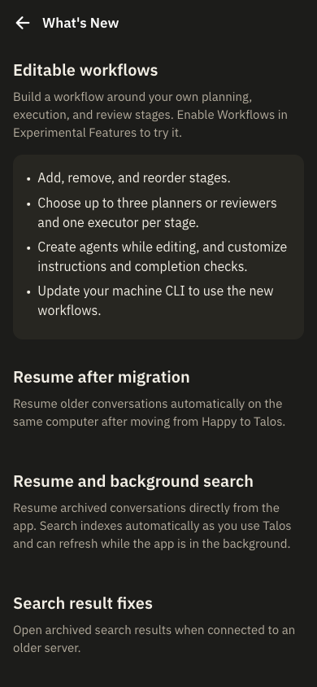

# Editable workflow release validation

This release prepares `talosapp@1.0.12` and `@ahmadposten/talos-wire@0.1.3` for the editable stages merged in [PR #47](https://github.com/Posten-Lab/happy-that-works/pull/47).

- `pnpm install --frozen-lockfile`: passed.
- Wire `prepublishOnly`: 34 tests passed.
- CLI `prepublishOnly`: build and 1,050 tests passed.
- Server `prepublishOnly` with CI-pinned Bun 1.4.2 and `APP_ENV=production`: build, production web export and 112 tests passed. The first attempt lacked Bun on PATH; the corrected invocation passed.
- Agent build and `pnpm verify:brand`: passed.
- Real browser: restarted the isolated `bold-birch` services, opened `/changelog`, verified the new release notes and captured the 390 × 844 viewport below.
- Full feature execution and native UI evidence remain in [the workflow builder evidence](../workflow-builder/README.md).

Deployment order: hold Jenkins deployment jobs; merge feature and release PRs; publish wire then verify the CLI tarball against registry wire; publish CLI; update both canonical machines and verify capability 2 and session continuity; restore Jenkins jobs and deploy web/API/mobile through the guarded pipeline.
